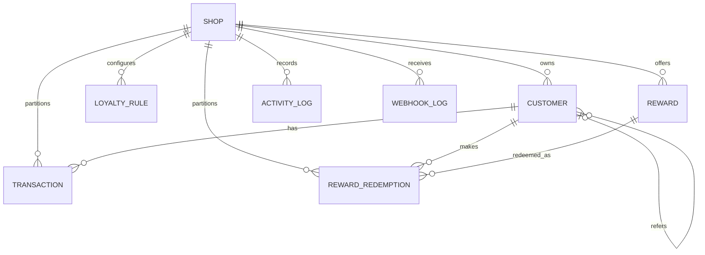

# Database schema

Every tenant-owned query includes `shopDomain`. Mongoose timestamps are UTC dates. Object IDs are MongoDB `ObjectId` values.

## Collections

- **Shop**: `shopDomain` (required unique lowercase string), `accessToken` (required, excluded from normal query selection), optional `scope`, `isActive` (default true), `installedAt`, and optional `uninstalledAt`.
- **Customer**: required indexed `shopDomain`; optional indexed `shopifyCustomerId`; required lowercase `email` unique within a shop; optional `name`, hidden `portalPasswordHash`, `birthday`, and self-referencing `referredBy`; non-negative `currentPoints`, `lifetimePoints`, `redeemedPoints`, and `totalSpend`; `tier` (`Bronze`, `Silver`, `Gold`, `Platinum`), optional `tierUpdatedAt`, required tenant-unique `referralCode`, `isActive`, `createdAt`, and `updatedAt`.
- **LoyaltyRule**: indexed `shopDomain`, required `name`, `type` (`purchase`, `signup`, `birthday`, `review`, `referral`), optional non-negative `pointsPerAmount`, `flatPoints`, and `minSpend`, `isActive`, and timestamps.
- **Reward**: indexed `shopDomain`, required `name`, `type` (`percentage_discount`, `fixed_discount`, `free_shipping`, `free_product`), optional non-negative `value`, optional Shopify GID `freeProductId`, positive `pointsRequired`, nullable positive `usageLimitPerCustomer`, `isActive`, and timestamps.
- **Transaction**: append-only ledger containing indexed `shopDomain` and `customerId`, `type` (`earn`, `redeem`, `expire`, `adjust`), signed `points`, `source` (`order`, `signup`, `birthday`, `review`, `referral`, `redemption`, `expiration`, `manual`), optional `referenceId`, non-negative `balanceAfter`, optional `expiresAt`, and `createdAt`. A compound source/reference index supports idempotency and reversal lookup.
- **RewardRedemption**: indexed `shopDomain`, customer and reward references, `pointsDeducted`, optional `discountCode` and `shopifyDiscountId`, `status` (`pending`, `success`, `failed`), optional `failureReason`, and `createdAt`.
- **ActivityLog**: indexed `shopDomain`, `type` (`webhook`, `api`, `error`, `job`), required `action`, arbitrary `metadata`, and `createdAt`.
- **WebhookLog**: indexed `shopDomain`, globally unique indexed `webhookId`, `topic`, internal `status` (`pending`, `processed`, `failed`), `receivedAt`, and optional `failureReason`. `pending` is an intentional extension used as an atomic concurrency claim; failed claims are released so Shopify can retry.

Balances are denormalized for fast reads while `Transaction` remains the audit source of truth. A periodic reconciliation process is recommended at larger scale.
